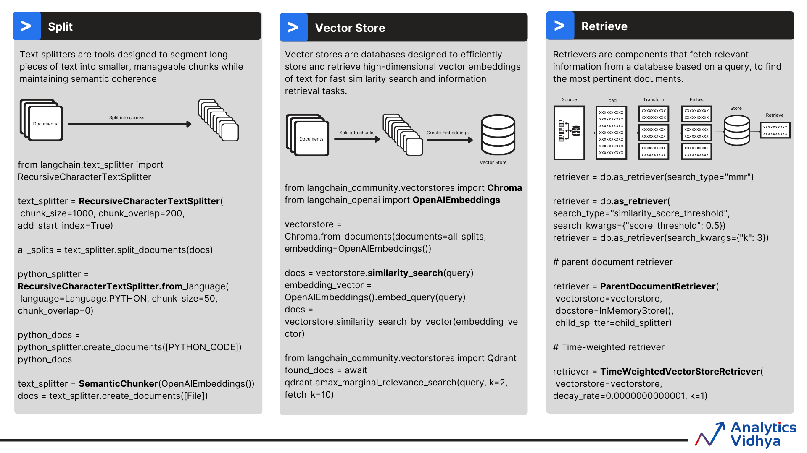
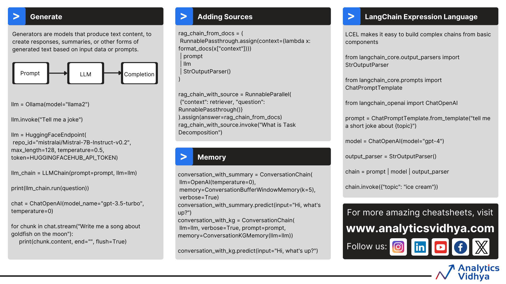

# LangChain & LangGraph Cheat Sheet

[TOC]

This cheat sheet provides a deep, end-to-end reference for LangChain and LangGraph: core components, LCEL, memory, agents, RAG, embeddings, graph construction, routing, serving/deployment, and monitoring. Each concept is shown with a concise explanation, ASCII/Unicode box-drawing diagram, practical code, and actionable tips.

??? note "**LangChain / LangGraph Visual Cheatsheets**"

    
    
    
    
    

## Quick Start (LCEL minimal chain)
```python
from langchain_openai import ChatOpenAI
from langchain_core.prompts import ChatPromptTemplate
from langchain_core.output_parsers import StrOutputParser

llm = ChatOpenAI(model="gpt-4o-mini", temperature=0)
prompt = ChatPromptTemplate.from_messages([
    ("system", "You are concise."),
    ("user", "Question: {question}")
])
chain = prompt | llm | StrOutputParser()

print(chain.invoke({"question": "What is LangChain?"}))
```

## Important Links
- LangChain Python Docs: https://python.langchain.com
- LangGraph Docs: https://langchain-ai.github.io/langgraph/
- LangServe Docs: https://python.langchain.com/docs/langserve
- LangSmith Docs: https://docs.smith.langchain.com
- LCEL Guide: https://python.langchain.com/docs/expression_language/

## Getting Started
**Brief:** Install core packages, set API keys, and verify environment.

**Diagram:**
```text
┌──────────────┐    ┌─────────────┐    ┌─────────────┐
│  Install     │→→→│  Configure   │→→→│  Validate    │
│  langchain   │    │  API Keys   │    │  imports    │
└──────────────┘    └──────┬──────┘    └──────┬──────┘
                            │                 │
                            ↓                 ↓
                   ┌────────────────┐   ┌────────────┐
                   │ OPENAI_API_KEY │   │ python -c  │
                   │ HUGGINGFACE_*  │   │  "import   │
                   └────────────────┘   │  langchain"│
                                        └────────────┘
```

**Code:**
```bash
pip install "langchain>=0.3" "langgraph>=0.2" langchain-openai langchain-community langchain-core
# Optional extras: vector stores, parsers, serving
pip install faiss-cpu chromadb pinecone-client weaviate-client pydantic openai fastapi uvicorn redis
```
```python
import os
os.environ["OPENAI_API_KEY"] = "sk-..."
# Optional: LangSmith for tracing
os.environ["LANGCHAIN_API_KEY"] = "ls_..."
os.environ["LANGCHAIN_ENDPOINT"] = "https://api.smith.langchain.com"
```

**Tips:**
- Keep secrets in env vars or `.env` + `python-dotenv`.
- Pin versions for reproducibility (`pip freeze > requirements.txt`).
- Verify GPU/CPU availability before large embeddings.

## Core LangChain Components
**Brief:** Models (LLMs vs Chat), Prompts, Output Parsers, Chains.

**Diagram:**
```text
┌─────────┐   ┌──────────┐   ┌──────────────┐   ┌─────────┐
│ Input   │ → │ Prompt   │ → │ Model (LLM/  │ → │ Parser  │
│ (user)  │   │ Template │   │ ChatModel)   │   │ (struct)│
└─────────┘   └──────────┘   └──────┬───────┘   └────┬────┘
                                     │              │
                                     ↓              ↓
                                 ┌────────┐    ┌──────────┐
                                 │ Chain  │ →  │ Output   │
                                 └────────┘    └──────────┘
```

**Code:**
```python
from langchain_openai import ChatOpenAI
from langchain_core.prompts import ChatPromptTemplate
from langchain_core.output_parsers import StrOutputParser

llm = ChatOpenAI(model="gpt-4o-mini", temperature=0)
prompt = ChatPromptTemplate.from_messages([
    ("system", "You are concise."),
    ("user", "Question: {question}")
])
chain = prompt | llm | StrOutputParser()
print(chain.invoke({"question": "What is LangChain?"}))
```

**Tips:**
- Use `temperature=0` for deterministic outputs; higher for creativity.
- Always parse outputs for downstream safety (JSON, Pydantic, etc.).
- Prefer Chat models for function/tool calling.

## Prompt Templates (String, Chat, Few-Shot)
**Brief:** Parameterized prompts to control style and context.

**Diagram:**
```text
┌─────────────┐   variables   ┌─────────────────┐
│ Base Prompt │ ───────────→  │ Rendered Prompt │
└─────┬───────┘               └────────┬────────┘
      │ few-shot examples               │ to model
      ↓                                 ↓
┌─────────────┐                 ┌───────────────┐
│ Example 1   │                 │ Chat Messages │
├─────────────┤                 └───────────────┘
│ Example 2   │
└─────────────┘
```

**Code:**
```python
from langchain_core.prompts import (PromptTemplate, ChatPromptTemplate,
                                    FewShotPromptTemplate)

string_prompt = PromptTemplate.from_template("Translate to French: {text}")
chat_prompt = ChatPromptTemplate.from_messages([
    ("system", "You are a translator."),
    ("user", "Translate: {text}")
])
examples = [
    {"text": "hello", "translation": "bonjour"},
    {"text": "good night", "translation": "bonne nuit"},
]
example_prompt = PromptTemplate.from_template("Input: {text}\nOutput: {translation}")
few_shot = FewShotPromptTemplate(
    examples=examples,
    example_prompt=example_prompt,
    prefix="Use examples to guide style.",
    suffix="Input: {text}\nOutput:",
    input_variables=["text"],
)
print(few_shot.format(text="thank you"))
```

**Tips:**
- Keep examples short; match target style.
- Use placeholders consistently; validate with `prompt.format()`.
- For chat, keep system message focused; add guardrails.

## LCEL (LangChain Expression Language)
**Brief:** Compose chains with `|`, parallel branches, passthrough, streaming, async.

**Diagram (LCEL Pipe Flow):**
```text
Input
  │
  ├─→ ┌──────────┐ → ┌────────────┐ → ┌──────────────┐ → Output
  │   │ Transform │   │ Transform  │   │ Transform    │
  │   └──────────┘   └────────────┘   └──────────────┘
  │
  └─→ ┌───────────────┐
      │ RunnableParallel│ (fan-out, then merge)
      └───────────────┘
```

**Code:**
```python
from langchain_core.runnables import RunnableParallel, RunnablePassthrough
from langchain_core.output_parsers import StrOutputParser

prompt = ChatPromptTemplate.from_messages([
    ("system", "Summarize and extract keywords."),
    ("user", "{text}")
])
branch = RunnableParallel(
    summary=prompt | llm | StrOutputParser(),
    keywords=prompt | llm | StrOutputParser(),
)
chain = RunnablePassthrough.assign(text=lambda x: x["text"]) | branch
result = chain.invoke({"text": "LangChain simplifies LLM orchestration."})
print(result)
```

**Tips:**
- Use `assign` to enrich inputs without losing originals.
- `astream()`/`astream_events()` for streaming tokens/events.
- Compose sync/async seamlessly; prefer async for I/O-heavy pipelines.

## Output Parsers (Pydantic, JSON, Structured)
**Brief:** Enforce structured outputs for safety and determinism.

**Diagram:**
```text
┌───────────┐   ┌──────────────┐   ┌────────────────┐
│ LLM Text  │ → │ OutputParser │ → │ Typed Object   │
└───────────┘   └──────┬───────┘   └────────┬───────┘
                       │ jsonschema         │ pydantic
                       ↓                    ↓
                ┌─────────────┐     ┌──────────────┐
                │ Validation  │     │ raise errors │
                └─────────────┘     └──────────────┘
```

**Code:**
```python
from pydantic import BaseModel, Field
from langchain.output_parsers import PydanticOutputParser
from langchain_core.prompts import ChatPromptTemplate

class Answer(BaseModel):
    summary: str = Field(..., description="Brief answer")
    sources: list[str]

parser = PydanticOutputParser(pydantic_object=Answer)
prompt = ChatPromptTemplate.from_messages([
    ("system", "Return JSON matching the schema."),
    ("user", "Question: {question}\n{format_instructions}")
]).partial(format_instructions=parser.get_format_instructions())

chain = prompt | llm | parser
print(chain.invoke({"question": "What is LangGraph?"}))
```

**Tips:**
- Use `OutputFixingParser` to auto-correct near-misses.
- Prefer `StructuredOutputParser`/`PydanticOutputParser` for reliability.
- Validate early before persisting to DBs.

## Memory Systems
**Brief:** Store conversational context: buffer, summary, windowed, vector, entity-aware.

**Diagram (Memory Types Comparison):**
```text
┌───────────────┬───────────────────────┬──────────────────────────┐
│ Type          │ Pros                  │ Cons                     │
├───────────────┼───────────────────────┼──────────────────────────┤
│ Buffer        │ Exact history         │ Grows unbounded          │
│ BufferWindow  │ Recent k messages     │ Loses older context      │
│ Summary       │ Compressed narrative  │ Possible detail loss     │
│ VectorStore   │ Semantic recall       │ Needs embeddings/store   │
│ EntityMemory  │ Tracks entities slots │ Setup complexity         │
└───────────────┴───────────────────────┴──────────────────────────┘
```

**Code:**
```python
from langchain.memory import (ConversationBufferMemory,
    ConversationBufferWindowMemory, ConversationSummaryMemory,
    ConversationEntityMemory)
from langchain.vectorstores import FAISS
from langchain.embeddings import OpenAIEmbeddings

buffer = ConversationBufferMemory(return_messages=True)
window = ConversationBufferWindowMemory(k=3, return_messages=True)
summary = ConversationSummaryMemory(llm=llm, return_messages=True)
entity = ConversationEntityMemory(llm=llm)

# Vector store memory
embedding = OpenAIEmbeddings()
vs = FAISS.from_texts(["Hello world"], embedding)
```

**Tips:**
- Pick memory based on cost vs fidelity: window for short chats; summary for long.
- Vector memory helps retrieve semantic context; tune chunk size/overlap.
- Clear memory per session to avoid leakage across users.

## Agents & Tools
**Brief:** Agents choose tools dynamically; tools expose functions.

**Diagram (Agent Decision Loop):**
```text
                ┌─────────────────┐
                │   Start Agent   │
                └────────┬────────┘
                         ↓
                ┌────────────────────────────────┐
                │      OBSERVE                    │
                │  - User query                   │
                │  - Previous tool outputs        │
                │  - Current state                │
                └────────┬───────────────────────┘
                         ↓
                ┌────────────────────────────────┐
                │   THINK (LLM Reasoning)        │
                │  - Analyze observation         │
                │  - Review available tools      │
                │  - Plan next action            │
                └────────┬───────────────────────┘
                         ↓
                ┌────────────────────┐
                │      DECIDE        │
                └────────┬───────────┘
                         │
        ┌────────────────┼────────────────┐
        ↓                ↓                ↓
┌─────────────┐  ┌─────────────┐  ┌─────────────┐
│ Use Tool A  │  │ Use Tool B  │  │ Final Answer│
└─────────────┘  └─────────────┘  └─────────────┘
                         ↓
                ┌────────────────────┐
                │       ACT          │
                └────────────────────┘
```

**Diagram (Agent with Multiple Tools):**
```text
           ┌──────────────┐
           │ Agent Brain  │
           └──────┬───────┘
                  ↓
    ┌───────┬───────────┬───────────┬───────────┐
    ↓       ↓           ↓           ↓           ↓
┌──────┐ ┌───────┐  ┌────────┐  ┌────────┐  ┌─────────┐
│Search│ │Calc    │ │Weather │ │Custom  │ │Feedback  │
│API   │ │Tool    │ │Tool    │ │Tool    │ │Loop      │
└──┬───┘ └──┬─────┘  └──┬────┘  └──┬────┘  └────┬─────┘
   │        │           │         │            │
   └────────┴───────────┴─────────┴────────────┘
                  ↑ aggregated observation
```

**Diagram (Agent Type Selection Tree):**
```text
               ┌───────────────────────┐
               │ Need structured tools?│
               └───────────┬───────────┘
                           │Yes
                           ↓
                   ┌─────────────┐
                   │ Tool-Calling│ (OpenAI-style)
                   └────┬────────┘
                        │No
                        ↓
          ┌────────────────────────┐
          │ Dialogue heavy?        │
          └─────────┬──────────────┘
                    │Yes            │No
                    ↓               ↓
         ┌────────────────┐   ┌─────────────────────┐
         │ Conversational │   │ Zero-Shot ReAct     │
         │ Agent          │   │ (plan & act inline) │
         └────────────────┘   └─────────┬───────────┘
                                         │ Need long plans?
                                         ↓
                                 ┌──────────────┐
                                 │ Plan-and-Exec│
                                 └──────────────┘
```

**Code:**
```python
from langchain.agents import AgentExecutor, create_tool_calling_agent
from langchain.tools import tool

@tool
def multiply(a: float, b: float) -> float:
    """Multiply two numbers."""
    return a * b

llm_tools = ChatOpenAI(model="gpt-4o-mini", temperature=0)
prompt = ChatPromptTemplate.from_messages([
    ("system", "Use tools when helpful."),
    ("user", "{input}")
])
agent = create_tool_calling_agent(llm_tools, [multiply], prompt)
agent_executor = AgentExecutor(agent=agent, tools=[multiply], verbose=True)
print(agent_executor.invoke({"input": "What is 12*9?"}))
```

**Tips:**
- Keep tool signatures small, well-described docstrings.
- Return structured JSON to simplify parsing.
- Add guardrails (e.g., tool whitelists, max iterations).

## Agent Execution (loops, errors)
**Brief:** `AgentExecutor` orchestrates reasoning, tool calls, retries.

**Diagram:**
```text
┌──────────┐   ┌──────────────┐   ┌──────────────┐   ┌──────────┐
│ User In  │→→│ Agent Executor│→→│ Tool Calls    │→→│ Final Out │
└────┬─────┘   └──────┬───────┘   └──────┬───────┘   └────┬─────┘
         │ retry/backoff         │ errors    │ streaming tokens │
         ↓                       ↓           ↓                 ↓
    Logs/Traces           Error Handler  Partial Results   Return
```

**Code:**
```python
result = agent_executor.invoke({"input": "Plan weekend: check weather in NYC and suggest indoor/outdoor."})
# For streaming thoughts
for event in agent_executor.astream_events({"input": "..."}):
    print(event)
```

**Tips:**
- Set `handle_parsing_errors=True` or custom handler for robust runs.
- Cap `max_iterations`; log intermediate steps.
- Include tool observation snippets in prompts to avoid loops.

## RAG - Retrieval Augmented Generation
**Brief:** Retrieve relevant chunks then generate grounded answers.

**Diagram (RAG Full Pipeline):**
```text
┌────────────┐   ┌───────────┐   ┌──────────┐   ┌────────────┐   ┌──────────┐
│ Document   │ → │ Loaders   │ → │ Splitter │ → │ Embeddings │ → │ Vector DB│
│ Store/FS   │   │ (PDF/URL) │   │ chunks   │   │ (OpenAI/   │   │ (FAISS/  │
└─────┬──────┘   └────┬──────┘   └────┬─────┘   │ HF/Cohere) │   │ Chroma…) │
      │               │             │          └────┬──────┘   └────┬─────┘
      │               │             │               │              │
      │               │             │               ↓              ↓
      │               │             │        ┌────────────┐  ┌────────────┐
      │ Query         │             │        │ Similarity  │  │ Retrieved  │
      └───────────────┴─────────────┴──────→ │ Search      │→ │ Chunks     │
                                             └────┬───────┘  └────┬──────┘
                                                  ↓              ↓
                                            ┌──────────────────────────┐
                                            │ LLM (prompt with context)│
                                            └──────────────────────────┘
```

**Diagram (RAG Chain Types Table):**
```text
┌────────────┬───────────────┬────────────────────┬──────────────────────┐
│ Strategy   │ How           │ Pros               │ Cons                 │
├────────────┼───────────────┼────────────────────┼──────────────────────┤
│ Stuff      │ Concatenate   │ Simple, fast       │ Context length bound │
│ Map-Reduce │ Map chunks -> │ Scales, summaries  │ More LLM calls       │
│            │ partial, then │                    │                      │
│            │ reduce        │                    │                      │
│ Refine     │ Iterative add │ Keeps detail       │ Sequential latency   │
│ Map-Rerank │ Score each    │ Better precision   │ Costly reranking     │
└────────────┴───────────────┴────────────────────┴──────────────────────┘
```

**Code:**
```python
from langchain_community.document_loaders import WebBaseLoader
from langchain.text_splitter import RecursiveCharacterTextSplitter
from langchain.vectorstores import FAISS
from langchain.embeddings import OpenAIEmbeddings
from langchain.chains import RetrievalQA

loader = WebBaseLoader("https://python.langchain.com")
docs = loader.load()
splitter = RecursiveCharacterTextSplitter(chunk_size=800, chunk_overlap=120)
chunks = splitter.split_documents(docs)
emb = OpenAIEmbeddings()
vectorstore = FAISS.from_documents(chunks, emb)
retriever = vectorstore.as_retriever(search_type="similarity", search_kwargs={"k": 4})

qa_chain = RetrievalQA.from_chain_type(
    llm=llm,
    chain_type="map_reduce",  # or "stuff", "refine", "map_rerank"
    retriever=retriever,
)
print(qa_chain.invoke({"query": "How does LCEL work?"}))
```

**Tips:**
- Tune `chunk_size` to ~200-1000 tokens; overlap ~10-20%.
- Choose chain type per corpus size: `stuff` for small, `map_reduce` for large.
- Add citations by returning source metadata in prompt.

## Vector Stores (FAISS, Chroma, Pinecone, Weaviate)
**Brief:** Persistent similarity search backends.

**Diagram:**
```text
┌────────────┐   ┌─────────────┐   ┌─────────────┐
│ Text/Chunk │→→│ Embeddings   │→→│ Vector Store │
└────┬───────┘   └──────┬──────┘   └──────┬──────┘
     │                  │               │
     ↓                  ↓               ↓
 Query Text → embed → similarity search → Top-k IDs → Fetch docs
```

**Code:**
```python
# FAISS (local)
faiss_store = FAISS.from_documents(chunks, emb)
faiss_store.save_local("faiss_index")
faiss_loaded = FAISS.load_local("faiss_index", emb, allow_dangerous_deserialization=True)

# Chroma (local serverless)
from langchain_community.vectorstores import Chroma
chroma = Chroma.from_documents(chunks, emb, collection_name="docs")

# Pinecone (managed)
import pinecone
pinecone.Pinecone(api_key="...")
from langchain.vectorstores import Pinecone as PineconeVS
pinecone_index = pinecone.Index("langchain-demo")
pinecone_vs = PineconeVS(index=pinecone_index, embedding_function=emb.embed_query)

# Weaviate (managed/self-hosted)
import weaviate
client = weaviate.Client("https://xyz.weaviate.network", auth_client_secret=weaviate.AuthApiKey("..."))
```

**Tips:**
- Pick HNSW (Chroma/Weaviate) for fast recall; IVF/Flat in FAISS for precision.
- Normalize vectors for cosine similarity when required.
- Persist indexes; align embedding model at query and ingest time.

## Document Processing (Loaders, Splitters)
**Brief:** Load diverse sources and split text for retrieval.

**Diagram (Text Splitter Strategies):**
```text
┌──────────────┬───────────────────────────┬──────────────────────────┐
│ Strategy     │ How                       │ Best For                 │
├──────────────┼───────────────────────────┼──────────────────────────┤
│ Character    │ Fixed chars + overlap     │ Clean text               │
│ Recursive    │ Fallback by delimiters    │ Mixed formats            │
│ Token-based  │ Token counts (tiktoken)   │ Token budgets            │
│ Semantic     │ Embedding-based merge     │ Coherent chunks          │
└──────────────┴───────────────────────────┴──────────────────────────┘
```

**Code:**
```python
from langchain_community.document_loaders import PyPDFLoader, CSVLoader
from langchain.text_splitter import (CharacterTextSplitter,
    RecursiveCharacterTextSplitter, TokenTextSplitter)

pdf_docs = PyPDFLoader("file.pdf").load()
csv_docs = CSVLoader("data.csv").load()

rec_splitter = RecursiveCharacterTextSplitter(chunk_size=500, chunk_overlap=80)
chunks = rec_splitter.split_documents(pdf_docs + csv_docs)
```

**Tips:**
- Strip headers/footers before splitting PDFs when possible.
- Use `TokenTextSplitter` for strict token budgets.
- Preserve metadata (page, URL) for citations.

## Embeddings (OpenAI, HF, Cohere, local)
**Brief:** Convert text to vectors for similarity search.

**Diagram:**
```text
┌──────────┐   ┌──────────────┐   ┌──────────────┐
│ Raw Text │→→│ Embed Model   │→→│ Vector (dims) │
└──────────┘   └──────┬───────┘   └──────┬───────┘
                  │ norm           │ store/reuse
                  ↓                ↓
              Cache/DB        Retrieval pipelines
```

**Code:**
```python
from langchain_openai import OpenAIEmbeddings
from langchain_community.embeddings import HuggingFaceEmbeddings, CohereEmbeddings

openai_emb = OpenAIEmbeddings(model="text-embedding-3-small")
hf_emb = HuggingFaceEmbeddings(model_name="sentence-transformers/all-MiniLM-L6-v2")
cohere_emb = CohereEmbeddings(model="embed-english-light-v3.0", cohere_api_key="...")
```

**Tips:**
- Match embedding model language/domain to corpus.
- Batch embeddings to reduce latency; cache results.
- For local privacy, prefer HF or GGUF-based models.

## LangGraph Basics (state)
**Brief:** Build graphs where nodes are steps; state carried via typed dicts/reducers.

**Diagram (StateGraph Execution):**
```text
┌────────┐   ┌──────────┐   ┌──────────┐   ┌────────┐
│ START  │ → │ Node A   │ → │ Node B   │ → │ END    │
└────────┘   └────┬─────┘   └────┬─────┘   └────────┘
                  │            │
                  └─────→──────┘ (conditional edge)
```

**Diagram (State Reducer Behavior):**
```text
With reducer (operator.add):           Without reducer:
┌──────────┐   ┌──────────┐           ┌──────────┐   ┌──────────┐
│ state=1  │ → │ add 2    │ = 3      │ state=1  │ → │ set 2    │ = 2
└──────────┘   └──────────┘           └──────────┘   └──────────┘
```

**Code:**
```python
from typing import TypedDict, Annotated
from operator import add
from langgraph.graph import StateGraph, END

class GraphState(TypedDict):
    message: str
    steps: Annotated[list[str], add]  # reducer concatenates lists

graph = StateGraph(GraphState)

def start(state: GraphState):
    return {"message": state["message"], "steps": ["start"]}

def finish(state: GraphState):
    return {"message": state["message"], "steps": state["steps"] + ["finish"]}

graph.add_node("start", start)
graph.add_node("finish", finish)
graph.add_edge("start", "finish")
graph.set_entry_point("start")
graph.set_finish_point("finish")
compiled = graph.compile()
print(compiled.invoke({"message": "hi", "steps": []}))
```

**Tips:**
- Use reducers (e.g., `operator.add`) for accumulating lists/counters safely.
- TypedDict enforces state shape; fail fast on missing keys.
- Prefer pure functions for nodes; keep side-effects minimal.

## LangGraph Construction (nodes/edges)
**Brief:** Build graphs with nodes, edges, conditionals.

**Code:**
```python
from langgraph.graph import StateGraph, END

g = StateGraph(GraphState)

g.add_node("decide", lambda s: {"route": "a" if "math" in s["message"] else "b"})

g.add_node("tool_a", lambda s: {"result": "used A"})
g.add_node("tool_b", lambda s: {"result": "used B"})

# Conditional routing
from langgraph.graph import add_conditional_edges

add_conditional_edges(
    g,
    source="decide",
    path_map={"a": "tool_a", "b": "tool_b"},
)

g.add_edge("tool_a", END)
g.add_edge("tool_b", END)

g.set_entry_point("decide")
compiled = g.compile()
print(compiled.invoke({"message": "math question", "steps": []}))
```

**Tips:**
- Always set entry + finish points.
- Use `add_conditional_edges` for clean branching logic.
- Keep node names descriptive; log transitions for debugging.

## LangGraph Execution (invoke, stream, checkpoint)
**Brief:** Run graphs sync/async with streaming and persistence.

**Diagram:**
```text
┌────────┐   invoke()   ┌──────────┐   stream tokens   ┌────────────┐
│ Client │────────────→│ Graph    │────────────────→  │ Responses  │
└────────┘              └──────────┘                  └────────────┘
       │ checkpoint
       └────────────→ storage (Redis/S3/DB)
```

**Code:**
```python
compiled = graph.compile(checkpointer=None)  # or Redis/S3 checkpointer

# Single call
compiled.invoke({"message": "hi", "steps": []})

# Streaming
for event in compiled.astream_events({"message": "hi", "steps": []}):
    print(event)

# Checkpointing with Redis (resume later)
from langgraph.checkpoint.redis import RedisCheckpointSaver
import redis

r = redis.Redis(host="localhost", port=6379, db=0)
checkpointer = RedisCheckpointSaver(r)
compiled_ckpt = graph.compile(checkpointer=checkpointer)
run = compiled_ckpt.invoke({"message": "hi", "steps": []})
# ... later
compiled_ckpt.resume(run["checkpoint_id"])
```

**Tips:**
- Use a checkpointer (e.g., Redis) for resumable flows.
- Prefer streaming for chat UX; buffer for batch jobs.
- Persist state for human handoffs or crash recovery.

## Conditional Routing
**Brief:** Route based on state values or model decisions.

**Diagram:**
```text
┌────────┐   ┌────────────┐   ┌──────────────┐
│ Input  │→→│ Router Node │→→│ Branch A      │
└────────┘   └────┬───────┘   └─────┬────────┘
                  │                │
                  ↓                ↓
         ┌────────────────────────────┐
         │  Branch B                  │
         └────────────────────────────┘
```

**Code:**
```python
def router(state):
    if "finance" in state["message"]:
        return "finance"
    return "general"

add_conditional_edges(g, "decide", {"finance": "tool_b", "general": "tool_a"})
```

**Tips:**
- Keep routing functions pure and deterministic when possible.
- For LLM-based routing, constrain outputs (JSON labels) and validate.
- Add default fallbacks to avoid dead ends.

## Multi-Agent Patterns
**Brief:** Supervisor coordinates specialist agents.

**Diagram (Multi-Agent Supervisor):**
```text
┌──────┐   ┌─────────────┐   ┌──────────────┐
│User  │→→│ Supervisor   │→→│ Task Decompose│
└──┬───┘   └──────┬──────┘   └──────┬───────┘
   │              │                │
   ↓              ↓                ↓
┌────────┐  ┌──────────┐    ┌────────────┐    ┌─────────────┐
│Research│  │Writer    │    │FactChecker │    │CodeRunner   │
└────┬───┘  └────┬─────┘    └────┬──────┘    └────┬────────┘
     │          │               │                 │
     └──────────┴─────→─────────┴────→────────────┘
                    Aggregation → Final Answer
```

**Code:**
```python
# Pseudocode skeleton
supervisor = compiled  # a LangGraph coordinating agents
# Each specialist is a tool-calling chain; supervisor routes tasks
```

**Tips:**
- Give each agent narrow scope + tools; supervisor merges.
- Prevent loops with max hops/iterations.
- Log per-agent traces for debugging.

## Human-in-the-Loop
**Brief:** Interrupt, review, then resume with checkpoints.

**Diagram (Human-in-the-Loop Flow):**
```text
┌─────────────┐   ┌───────────┐   ┌───────────┐   ┌───────────┐
│ Execute     │→→│ Checkpoint │→→│ Interrupt  │→→│ Human OK? │
└─────┬───────┘   └────┬──────┘   └────┬──────┘   └────┬──────┘
      │                │             │             │Yes │No
      ↓                ↓             ↓             ↓    ↓
   Resume ←────────── Save        Review      Reject/Amend
```

**Code:**
```python
# Use a checkpointer; pause on specific node
state = compiled.invoke(...)
# Later, resume with stored checkpoint id
compiled.resume(checkpoint_id="abc123")
```

**Tips:**
- Define explicit pause points (e.g., before external actions).
- Store human feedback in state for auditability.
- Timebox approvals to avoid stale sessions.

## Serving & Deployment (LangServe + FastAPI)
**Brief:** Expose chains/graphs as REST endpoints.

**Diagram (LangServe Deployment):**
```text
Client → API Gateway → LangServe (FastAPI) → Chain/Graph → Response
```

**Code (LangServe):**
```python
# app.py
from fastapi import FastAPI
from langserve import add_routes
from my_chains import chain, graph

app = FastAPI()
add_routes(app, chain, path="/chain")
add_routes(app, graph, path="/graph")

# Run
# uvicorn app:app --reload --host 0.0.0.0 --port 8000
```

**Add Authentication:**
```python
# Simple API key guard
API_KEY = "changeme"
@app.middleware("http")
async def auth(request: Request, call_next):
    if request.headers.get("x-api-key") != API_KEY:
        raise HTTPException(status_code=401, detail="Unauthorized")
    return await call_next(request)
```

**Test/Call with curl:**
```bash
curl -X POST "http://localhost:8000/chain/invoke" \
    -H "x-api-key: changeme" \
    -H "Content-Type: application/json" \
    -d '{"input": {"question": "Hello"}}'
```

**Tips:**
- Validate request schemas; limit concurrency via worker settings.
- Use `uvicorn --workers` for CPU-bound or async I/O.
- Add auth (API keys/JWT) at gateway or FastAPI middleware.

## Production Deployment (Docker, scaling)
**Brief:** Containerize, scale horizontally, add caching and observability.

**Diagram (Production Architecture):**
```text
┌──────────────┐   ┌───────────────┐   ┌───────────┐   ┌──────────┐
│ Clients      │→→│ Load Balancer │→→│ App Pods  │→→│ Vector DB │
└──────────────┘   └──────┬────────┘   └────┬──────┘   └────┬─────┘
                          │                 │             │
                          ↓                 ↓             ↓
                     ┌────────┐       ┌─────────┐   ┌─────────┐
                     │ Redis  │       │ Postgres│   │ Metrics │
                     │ Cache  │       │ /S3     │   │+Tracing │
                     └────────┘       └─────────┘   └─────────┘
```

**Code (Dockerfile snippet):**
```dockerfile
FROM python:3.11-slim
WORKDIR /app
COPY requirements.txt .
RUN pip install -r requirements.txt
COPY . .
CMD ["uvicorn", "app:app", "--host", "0.0.0.0", "--port", "8000"]
```

**Tips:**
- Externalize secrets via env vars/secret managers.
- Use autoscaling on CPU/RAM/QPS; warm LLM connections.
- Add health probes (`/healthz`) and readiness checks.

**Docker Compose (app + chroma + prometheus minimal):**
```yaml
services:
    app:
        build: .
        environment:
            - OPENAI_API_KEY=${OPENAI_API_KEY}
        ports: ["8000:8000"]
        depends_on: [chroma]
    chroma:
        image: ghcr.io/chroma-core/chroma:latest
        ports: ["8001:8000"]
    prometheus:
        image: prom/prometheus:latest
        ports: ["9090:9090"]
```

## LangSmith Monitoring
**Brief:** Trace, debug, and evaluate chains/agents.

**Diagram:**
```text
┌──────────┐   ┌──────────┐   ┌──────────────┐   ┌────────────┐
│ Chains   │→→│ Tracer    │→→│ LangSmith UI  │→→│ Insights    │
└────┬─────┘   └────┬─────┘   └────┬─────────┘   └────┬───────┘
         │ logs/errors       │ spans         │ filters       │ actions
         ↓                   ↓               ↓              ↓
     Storage          Timing/Cost     Compare runs   Prompt fixes
```

**Code:**
```python
import os
os.environ["LANGCHAIN_TRACING_V2"] = "true"
os.environ["LANGCHAIN_PROJECT"] = "my-app"
# Traces auto-captured when using langchain core runtimes
```

**Tips:**
- Tag runs with metadata (user id, version) for filtering.
- Use datasets + evals to compare prompt/model changes.
- Inspect tool call errors to tighten parsing.

## Caching & Optimization
**Brief:** Reduce latency/cost via caching and prompt/model choices.

**Diagram:**
```text
┌──────────┐   ┌──────────┐   ┌──────────┐
│ Request  │→→│ Cache?    │→→│ Response  │
└────┬─────┘   └────┬─────┘   └────┬─────┘
         │ miss         │ hit         │
         ↓              ↓             ↓
     Call LLM   Return cached   Store result
```

**Code:**
```python
from langchain.cache import SQLiteCache
from langchain.globals import set_llm_cache
set_llm_cache(SQLiteCache(database_path=".langchain_cache.sqlite"))
```

**Tips:**
- Cache deterministic calls (temperature 0) keyed on prompt+input.
- Use shorter prompts, smaller models (`gpt-4o-mini`, `gpt-3.5-turbo`) for bulk.
- Batch embeddings; reuse vector store across sessions.

**Cost/Latency quick picks:**
```text
┌────────────┬─────────────────────────────┬────────────────────┐
│ Use Case   │ Model/Setting               │ Why                │
├────────────┼─────────────────────────────┼────────────────────┤
│ Cheap bulk │ gpt-3.5-turbo, temp 0       │ Low cost, fast     │
│ Quality    │ gpt-4o-mini, temp 0.2       │ Balance quality    │
│ Max quality│ gpt-4o, temp 0-0.3          │ Best reasoning     │
│ RAG ingest │ chunk 500-800, overlap 10%  │ Good recall/size   │
│ Caching    │ Redis/SQLite, key prompt+in │ Cut repeat costs   │
└────────────┴─────────────────────────────┴────────────────────┘
```

**Testing prompts/parsers (pytest sketch):**
```python
from langchain_core.prompts import ChatPromptTemplate
from langchain_core.output_parsers import StrOutputParser

def test_prompt_format():
    prompt = ChatPromptTemplate.from_messages([
        ("system", "Be short."),
        ("user", "{q}")
    ])
    rendered = prompt.format(q="hi")
    assert "hi" in rendered

def test_parser_deterministic(monkeypatch):
    parser = StrOutputParser()
    # Mock LLM call
    class FakeLLM:
        def invoke(self, *_args, **_kwargs):
            return "ok"
    chain = FakeLLM() | parser  # type: ignore
    assert chain.invoke({}) == "ok"
```

## RAG with LCEL (Modern Pattern)
**Brief:** Build RAG pipelines using LCEL pipe operator for clean composition.

**Diagram:**
```text
┌──────────┐   ┌───────────┐   ┌─────────────┐   ┌─────────┐   ┌──────────┐
│ Question │→→│ Retriever │→→│ Retrieved   │→→│ Prompt  │→→│ LLM      │
│          │   │ (vector)  │   │ Context     │   │ + Ctx   │   │ Answer   │
└──────────┘   └───────────┘   └─────────────┘   └─────────┘   └──────────┘
                     ↑                                                ↓
                     │ similarity search                              │
              ┌──────────────┐                                ┌───────────┐
              │ Vector Store │                                │ Parsed    │
              │ (embeddings) │                                │ Response  │
              └──────────────┘                                └───────────┘
```

**Code:**
```python
from langchain_openai import ChatOpenAI, OpenAIEmbeddings
from langchain_core.prompts import ChatPromptTemplate
from langchain_core.output_parsers import StrOutputParser
from langchain_core.runnables import RunnablePassthrough
from langchain_community.vectorstores import FAISS

# Setup
llm = ChatOpenAI(model="gpt-4o-mini")
embeddings = OpenAIEmbeddings()
vectorstore = FAISS.from_texts(
    ["LangChain simplifies LLM apps", "LCEL enables composition"],
    embeddings
)
retriever = vectorstore.as_retriever(search_kwargs={"k": 2})

# Build RAG chain with LCEL
template = """Answer based on context:
Context: {context}
Question: {question}
Answer:"""

prompt = ChatPromptTemplate.from_template(template)

rag_chain = (
    {"context": retriever, "question": RunnablePassthrough()}
    | prompt
    | llm
    | StrOutputParser()
)

# Use
answer = rag_chain.invoke("What is LangChain?")
```

**Tips:**
- Use `RunnablePassthrough()` to preserve input in parallel branches
- Chain components with `|` for readable pipelines
- Add `.with_config({"run_name": "rag"})` for better tracing

## Conversational RAG
**Brief:** RAG with conversation history for follow-up questions.

**Diagram:**
```text
┌──────────────┐   ┌──────────────────┐   ┌───────────┐   ┌──────────┐
│ New Question │→→│ + Chat History   │→→│ Retriever │→→│ Context  │
└──────────────┘   └────────┬─────────┘   └───────────┘   └────┬─────┘
                            │                                   │
                            ↓                                   ↓
                   ┌─────────────────┐              ┌────────────────────┐
                   │ Reformulated    │              │ Answer with        │
                   │ Question        │──────────────→│ Context + History  │
                   └─────────────────┘              └────────────────────┘
                            ↑                                   │
                            │                                   ↓
                   ┌─────────────────┐              ┌────────────────────┐
                   │ History Buffer  │←─────────────│ Update History     │
                   │ (last N turns)  │              └────────────────────┘
                   └─────────────────┘
```

**Code:**
```python
from langchain.chains import create_history_aware_retriever, create_retrieval_chain
from langchain.chains.combine_documents import create_stuff_documents_chain
from langchain_core.prompts import MessagesPlaceholder

# Contextualize question based on chat history
contextualize_prompt = ChatPromptTemplate.from_messages([
    ("system", "Reformulate question using chat history."),
    MessagesPlaceholder("chat_history"),
    ("human", "{input}"),
])

history_aware_retriever = create_history_aware_retriever(
    llm, retriever, contextualize_prompt
)

# Answer with retrieved context
qa_prompt = ChatPromptTemplate.from_messages([
    ("system", "Answer using context:\n{context}"),
    MessagesPlaceholder("chat_history"),
    ("human", "{input}"),
])

qa_chain = create_stuff_documents_chain(llm, qa_prompt)
rag_chain = create_retrieval_chain(history_aware_retriever, qa_chain)

# Use with history
from langchain_core.messages import HumanMessage, AIMessage

chat_history = [
    HumanMessage(content="What is LangChain?"),
    AIMessage(content="LangChain is a framework for LLM apps."),
]

result = rag_chain.invoke({
    "input": "What does it simplify?",
    "chat_history": chat_history
})
```

**Tips:**
- Store `chat_history` in session/database for multi-turn conversations
- Limit history to last 10 messages to control context window
- Use `ConversationBufferMemory` for automatic history management

## Structured Output with Pydantic
**Brief:** Get typed, validated responses using `with_structured_output`.

**Diagram:**
```text
┌──────────┐   ┌────────────┐   ┌─────────────┐   ┌──────────────┐
│ Prompt   │→→│ LLM        │→→│ JSON Schema │→→│ Pydantic     │
│ + Schema │   │ (function  │   │ Validation  │   │ Object       │
└──────────┘   │  calling)  │   └─────────────┘   └──────┬───────┘
               └────────────┘            ↓                │ typed
                      │                  │                ↓
                      │           ✓ Valid JSON    ┌──────────────┐
                      │                  │         │ .name, .age  │
                      │           ✗ Invalid        │ .email       │
                      └──────────→ Retry/Error     └──────────────┘
```

**Code:**
```python
from pydantic import BaseModel, Field
from langchain_openai import ChatOpenAI

class Person(BaseModel):
    name: str = Field(description="Person's full name")
    age: int = Field(description="Person's age")
    email: str = Field(description="Email address")

llm = ChatOpenAI(model="gpt-4o-mini", temperature=0)
structured_llm = llm.with_structured_output(Person)

# Get typed output
person = structured_llm.invoke("Extract info: John Doe, 30 years old, john@example.com")
print(f"{person.name} is {person.age}")  # Typed access

# In a chain
from langchain_core.prompts import ChatPromptTemplate

prompt = ChatPromptTemplate.from_messages([
    ("system", "Extract person information from text."),
    ("human", "{text}")
])

chain = prompt | structured_llm
result = chain.invoke({"text": "Jane Smith, age 25, jane@test.com"})
```

**Tips:**
- Use `Field(description=...)` for better extraction accuracy
- Works with OpenAI, Anthropic (function calling support required)
- Fallback to `PydanticOutputParser` for models without native support

## Async Operations
**Brief:** Use async for concurrent operations and better throughput.

**Diagram:**
```text
Sync (Sequential):                 Async (Parallel):
┌──────┐                           ┌──────────────────────┐
│ Q1   │ 2s                        │ Q1 │ Q2 │ Q3 │      │
├──────┤                           └──┬───┴──┬─┴──┬───────┘
│ Q2   │ 2s    Total: 6s              ↓      ↓    ↓       Total: 2s
├──────┤                           ┌────────────────────┐
│ Q3   │ 2s                        │ All complete       │
└──────┘                           └────────────────────┘

asyncio.gather() enables parallel execution:
┌───────────┐   ┌───────────┐   ┌───────────┐
│ ainvoke() │   │ ainvoke() │   │ ainvoke() │
│ Task 1    │   │ Task 2    │   │ Task 3    │
└─────┬─────┘   └─────┬─────┘   └─────┬─────┘
      └───────────────┴───────────────┘
                      │
              ┌───────▼────────┐
              │ await gather() │
              └───────┬────────┘
                      ↓
              ┌────────────────┐
              │ All Results    │
              └────────────────┘
```

**Code:**
```python
import asyncio
from langchain_openai import ChatOpenAI

llm = ChatOpenAI()

# Single async call
async def ask_question():
    response = await llm.ainvoke("What is AI?")
    return response.content

# Concurrent calls
async def ask_multiple():
    questions = ["What is AI?", "What is ML?", "What is NLP?"]
    tasks = [llm.ainvoke(q) for q in questions]
    responses = await asyncio.gather(*tasks)
    return [r.content for r in responses]

# Async streaming
async def stream_response():
    async for chunk in llm.astream("Explain quantum computing"):
        print(chunk.content, end="", flush=True)

# Run async
asyncio.run(ask_multiple())
```

**Tips:**
- Use `ainvoke()`, `astream()`, `abatch()` for async variants
- Combine with `asyncio.gather()` for parallel LLM calls
- Set concurrency limits to avoid rate limiting: `asyncio.Semaphore(5)`

## Error Handling & Retries
**Brief:** Handle failures gracefully with retries and fallbacks.

**Diagram:**
```text
Exponential Backoff:                 Fallback Chain:
┌────────────┐                       ┌─────────────┐
│ Try Call   │                       │ GPT-4o      │
└─────┬──────┘                       │ (primary)   │
      │                              └──────┬──────┘
      ↓ Error                               │ Error
┌────────────┐                              ↓
│ Wait 2^0=1s│                       ┌─────────────┐
└─────┬──────┘                       │ GPT-4o-mini │
      │                              │ (fallback)  │
      ↓ Error                        └──────┬──────┘
┌────────────┐                              │ Error
│ Wait 2^1=2s│                              ↓
└─────┬──────┘                       ┌─────────────┐
      │                              │ GPT-3.5     │
      ↓ Error                        │ (fallback2) │
┌────────────┐                       └──────┬──────┘
│ Wait 2^2=4s│                              │
└─────┬──────┘                              ↓
      │                              ┌─────────────┐
      ↓ Success/Fail                 │ Response or │
┌────────────┐                       │ Final Error │
│ Return     │                       └─────────────┘
└────────────┘
```

**Code:**
```python
from langchain_core.runnables import RunnableRetry
from langchain.callbacks.manager import CallbackManager
import time

# Retry with exponential backoff
def retry_with_backoff(func, max_retries=3):
    for attempt in range(max_retries):
        try:
            return func()
        except Exception as e:
            if attempt == max_retries - 1:
                raise
            wait_time = 2 ** attempt
            print(f"Retry {attempt+1} after {wait_time}s: {e}")
            time.sleep(wait_time)

# Use with chain
try:
    result = retry_with_backoff(lambda: chain.invoke({"question": "test"}))
except Exception as e:
    result = "Service unavailable, please try again later."

# Fallback chain
from langchain_core.runnables import RunnableWithFallbacks

primary_chain = prompt | ChatOpenAI(model="gpt-4o")
fallback_chain = prompt | ChatOpenAI(model="gpt-4o-mini")

chain_with_fallback = primary_chain.with_fallbacks([fallback_chain])
result = chain_with_fallback.invoke({"question": "test"})
```

**Tips:**
- Always set timeouts for production: `with_config({"timeout": 30})`
- Log errors with context for debugging
- Use fallback chains for model unavailability

## Multi-Query Retrieval
**Brief:** Generate multiple search queries for better recall.

**Diagram:**
```text
┌──────────────────┐
│ Original Query:  │
│ "LangChain uses" │
└────────┬─────────┘
         │
         ↓ LLM generates variations
┌────────────────────────────────┐
│ Query 1: "How to use LangChain"│
│ Query 2: "LangChain usage"     │──→ ┌───────────┐
│ Query 3: "LangChain examples"  │    │ Retriever │
│ Query 4: "LangChain guide"     │    └─────┬─────┘
└────────────────────────────────┘          │
                                            ↓
                              ┌──────────────────────────┐
                              │ Doc1, Doc2, Doc3, Doc4   │
                              │ Doc2, Doc5, Doc6         │
                              │ Doc1, Doc7, Doc8         │
                              │ Doc3, Doc9, Doc10        │
                              └────────────┬─────────────┘
                                           │ deduplicate
                                           ↓
                              ┌──────────────────────────┐
                              │ Unique: Doc1-10 (merged) │
                              │ Better recall vs single  │
                              └──────────────────────────┘
```

**Code:**
```python
from langchain.retrievers.multi_query import MultiQueryRetriever
from langchain_openai import ChatOpenAI

llm = ChatOpenAI(temperature=0)
retriever = vectorstore.as_retriever()

# Generates 3-5 variations of the query
multi_query_retriever = MultiQueryRetriever.from_llm(
    retriever=retriever,
    llm=llm
)

# Single query → multiple searches → deduplicated results
question = "What are the benefits of LangChain?"
docs = multi_query_retriever.invoke(question)

# Use in RAG chain
rag_chain = (
    {"context": multi_query_retriever, "question": RunnablePassthrough()}
    | prompt
    | llm
    | StrOutputParser()
)
```

**Tips:**
- Improves recall by 20-30% vs single query
- Slower due to multiple retrievals (use caching)
- Good for ambiguous or complex questions

## Hybrid Retrieval (Dense + Sparse)
**Brief:** Combine semantic search (vectors) with keyword search (BM25) for best recall.

**Diagram:**
```text
┌──────────────┐
│ User Query:  │
│ "python RAG" │
└──────┬───────┘
       │
       ├──────────────────────────────────┐
       │                                  │
       ↓ Dense (Semantic)                 ↓ Sparse (Keyword)
┌──────────────────┐              ┌──────────────────┐
│ Embedding Model  │              │ BM25 Algorithm   │
│ "RAG concepts"   │              │ Exact: "python"  │
│ "retrieval apps" │              │ Exact: "RAG"     │
└────────┬─────────┘              └────────┬─────────┘
         │                                 │
         ↓                                 ↓
┌────────────────────┐          ┌────────────────────┐
│ Semantic Results:  │          │ Keyword Results:   │
│ Doc1 (score: 0.92) │          │ Doc3 (score: 8.5)  │
│ Doc2 (score: 0.87) │          │ Doc1 (score: 7.2)  │
│ Doc4 (score: 0.81) │          │ Doc5 (score: 6.8)  │
└────────┬───────────┘          └────────┬───────────┘
         │                               │
         └───────────┬───────────────────┘
                     ↓ Reciprocal Rank Fusion (RRF)
         ┌───────────────────────────┐
         │ Combined & Reranked:      │
         │ Doc1 (both methods)       │
         │ Doc3 (keyword strong)     │
         │ Doc2 (semantic strong)    │
         │ Doc4, Doc5...             │
         └───────────────────────────┘
```

**Code:**
```python
from langchain.retrievers import EnsembleRetriever
from langchain_community.retrievers import BM25Retriever
from langchain_community.vectorstores import FAISS
from langchain_openai import OpenAIEmbeddings

# Setup documents
docs = [
    "Python is great for RAG applications",
    "LangChain simplifies retrieval-augmented generation",
    "Vector databases store embeddings efficiently",
    "BM25 is a keyword-based ranking algorithm"
]

# Dense retriever (semantic/vector)
embeddings = OpenAIEmbeddings()
vectorstore = FAISS.from_texts(docs, embeddings)
dense_retriever = vectorstore.as_retriever(search_kwargs={"k": 3})

# Sparse retriever (keyword/BM25)
sparse_retriever = BM25Retriever.from_texts(docs)
sparse_retriever.k = 3

# Hybrid: Combine both with weights
hybrid_retriever = EnsembleRetriever(
    retrievers=[dense_retriever, sparse_retriever],
    weights=[0.5, 0.5]  # Equal weight, tune as needed
)

# Retrieves using both methods, merges results
results = hybrid_retriever.invoke("python RAG")

# Use in RAG chain
from langchain_core.runnables import RunnablePassthrough
from langchain_core.output_parsers import StrOutputParser

rag_chain = (
    {"context": hybrid_retriever, "question": RunnablePassthrough()}
    | prompt
    | llm
    | StrOutputParser()
)
```

**Tips:**
- Hybrid typically improves recall by 15-25% vs dense-only
- Tune weights based on your data: [0.7, 0.3] for more semantic, [0.3, 0.7] for more keyword
- BM25 excels at exact matches (product codes, names), vectors at concepts
- For production, use Elasticsearch/Pinecone hybrid search endpoints (faster)

## Contextual Compression
**Brief:** Compress retrieved documents to only relevant parts.

**Diagram:**
```text
┌──────────┐   ┌───────────┐   ┌─────────────────────────┐
│ Question │→→│ Retriever │→→│ 10 Full Documents       │
└──────────┘   └───────────┘   │ (1000 tokens each)      │
                               └───────────┬─────────────┘
                                           │
                                           ↓ Compressor LLM
                               ┌───────────────────────────┐
                               │ Extract relevant snippets:│
                               │ Doc1: "...relevant..."    │
                               │ Doc2: "...key part..."    │
                               │ Doc3: "...answer..."      │
                               └───────────┬───────────────┘
                                           │ 50-80% reduction
                                           ↓
                               ┌───────────────────────────┐
                               │ Compressed Context        │
                               │ (200 tokens total)        │
                               └───────────┬───────────────┘
                                           │
                                           ↓
                               ┌───────────────────────────┐
                               │ Final Answer (cheaper +   │
                               │ more focused)             │
                               └───────────────────────────┘
```

**Code:**
```python
from langchain.retrievers import ContextualCompressionRetriever
from langchain.retrievers.document_compressors import LLMChainExtractor

llm = ChatOpenAI(temperature=0)
base_retriever = vectorstore.as_retriever(search_kwargs={"k": 10})

# Extract only relevant parts from each doc
compressor = LLMChainExtractor.from_llm(llm)
compression_retriever = ContextualCompressionRetriever(
    base_compressor=compressor,
    base_retriever=base_retriever
)

# Retrieves 10 docs, compresses to relevant snippets
compressed_docs = compression_retriever.invoke("What is LCEL?")

# Use in RAG
rag_chain = (
    {"context": compression_retriever, "question": RunnablePassthrough()}
    | prompt
    | llm
    | StrOutputParser()
)
```

**Tips:**
- Reduces token usage by 50-80% (saves cost)
- Improves answer quality by removing noise
- Slower due to compression LLM calls

## Streaming Responses
**Brief:** Stream tokens for better UX in chat applications.

**Diagram:**
```text
Non-Streaming (Batch):              Streaming (Token-by-Token):
┌────────────┐                      ┌────────────┐
│ User waits │                      │ User sees  │
│ 5 seconds  │                      │ "The"      │ 200ms
└──────┬─────┘                      ├────────────┤
       │                            │ "The sky"  │ 400ms
       ↓                            ├────────────┤
┌────────────────────┐              │ "The sky   │ 600ms
│ Full response:     │              │  is blue"  │
│ "The sky is blue   │              └──────┬─────┘
│  because of Rayle- │                     │
│  igh scattering."  │              Better perceived speed!
└────────────────────┘

Flow:
┌──────────┐   ┌─────────┐   ┌──────────┐   ┌──────────┐
│ Prompt   │→→│ LLM     │→→│ Token 1  │→→│ Display  │
└──────────┘   └────┬────┘   ├──────────┤   └──────────┘
                    │        │ Token 2  │→→
                    │        ├──────────┤
                    └───────→│ Token 3  │→→
                             └──────────┘
```

**Code:**
```python
from langchain_openai import ChatOpenAI
from langchain_core.prompts import ChatPromptTemplate

llm = ChatOpenAI(streaming=True)
prompt = ChatPromptTemplate.from_messages([
    ("system", "You are helpful."),
    ("user", "{question}")
])

chain = prompt | llm

# Stream tokens
for chunk in chain.stream({"question": "Explain quantum computing"}):
    print(chunk.content, end="", flush=True)

# Async streaming
async for chunk in chain.astream({"question": "test"}):
    print(chunk.content, end="", flush=True)

# With callbacks
from langchain.callbacks.streaming_stdout import StreamingStdOutCallbackHandler

llm = ChatOpenAI(
    streaming=True,
    callbacks=[StreamingStdOutCallbackHandler()]
)
```

**Tips:**
- Essential for chat UX (perceived speed improvement)
- Use `astream_events()` for granular control (tokens, tool calls)
- Buffer partial responses for display

## Function/Tool Calling
**Brief:** Let LLM call functions with structured arguments.

**Diagram:**
```text
┌──────────────────────┐
│ User: "Weather in   │
│        NYC and       │
│        12 * 15?"     │
└──────────┬───────────┘
           │
           ↓
┌──────────────────────┐   Available Tools:
│ LLM Decides:         │   ┌─────────────────┐
│                      │   │ get_weather()   │
│ 1. get_weather(NYC)  │←──│ calculate()     │
│ 2. calculate(12*15)  │   │ search()        │
└──────────┬───────────┘   └─────────────────┘
           │
           ↓
┌──────────────────────────────────┐
│ Execute Tools:                   │
│ ┌────────────────────────────┐   │
│ │ Tool 1: get_weather("NYC") │   │
│ │ Result: "Sunny, 72°F"      │   │
│ └────────────────────────────┘   │
│ ┌────────────────────────────┐   │
│ │ Tool 2: calculate("12*15") │   │
│ │ Result: 180                │   │
│ └────────────────────────────┘   │
└──────────────┬───────────────────┘
               │
               ↓
┌──────────────────────────────────┐
│ LLM Synthesizes:                 │
│ "NYC weather is sunny and 72°F.  │
│  12 * 15 = 180"                  │
└──────────────────────────────────┘
```

**Code:**
```python
from langchain_core.tools import tool
from langchain_openai import ChatOpenAI

@tool
def get_weather(city: str) -> str:
    """Get current weather for a city."""
    # In production, call actual API
    return f"Weather in {city}: Sunny, 72°F"

@tool
def calculate(expression: str) -> float:
    """Evaluate a mathematical expression."""
    return eval(expression)

llm = ChatOpenAI(model="gpt-4o-mini")
llm_with_tools = llm.bind_tools([get_weather, calculate])

# LLM decides which tool to call
response = llm_with_tools.invoke("What's the weather in NYC?")
tool_calls = response.tool_calls

# Execute tool
if tool_calls:
    tool_name = tool_calls[0]["name"]
    tool_args = tool_calls[0]["args"]
    if tool_name == "get_weather":
        result = get_weather.invoke(tool_args)

# Or use agent for automatic execution
from langchain.agents import AgentExecutor, create_tool_calling_agent

agent = create_tool_calling_agent(llm, [get_weather, calculate], prompt)
executor = AgentExecutor(agent=agent, tools=[get_weather, calculate])
result = executor.invoke({"input": "Weather in SF and calculate 15*23"})
```

**Tips:**
- Use clear docstrings (LLM uses them for tool selection)
- Add type hints for better argument parsing
- Validate tool outputs before returning to user

## Batch Processing
**Brief:** Process multiple inputs efficiently in parallel.

**Diagram:**
```text
Sequential Processing:              Batch Processing (max_concurrency=3):
┌──────────┐                       ┌──────────┐ ┌──────────┐ ┌──────────┐
│ Input 1  │ 1s                    │ Input 1  │ │ Input 2  │ │ Input 3  │
├──────────┤                       └────┬─────┘ └────┬─────┘ └────┬─────┘
│ Input 2  │ 1s   Total: 5s             │            │            │
├──────────┤                             ─────────────────────────
│ Input 3  │ 1s                                  │
├──────────┤                                     ↓
│ Input 4  │ 1s                         ┌────────────────┐
├──────────┤                            │ Process batch  │
│ Input 5  │ 1s                         │ concurrently   │
└──────────┘                            └───────┬────────┘
                                               │
                                               ↓
                                    ┌──────────┐ ┌──────────┐
                                    │ Input 4  │ │ Input 5  │
                                    └────┬─────┘ └────┬─────┘
                                          ──────────────
                                              │  Total: 2s (2.5x faster)
                                              ↓
                                    ┌─────────────────┐
                                    │ All 5 Results   │
                                    └─────────────────┘
```

**Code:**
```python
from langchain_openai import ChatOpenAI
from langchain_core.prompts import ChatPromptTemplate

llm = ChatOpenAI()
prompt = ChatPromptTemplate.from_messages([
    ("system", "Translate to French."),
    ("user", "{text}")
])

chain = prompt | llm

# Batch invoke
inputs = [{"text": "hello"}, {"text": "goodbye"}, {"text": "thank you"}]
results = chain.batch(inputs)

# With concurrency limit
results = chain.batch(inputs, config={"max_concurrency": 5})

# Async batch
import asyncio
results = asyncio.run(chain.abatch(inputs))

# Stream multiple
for output in chain.batch(inputs):
    print(output.content)
```

**Tips:**
- Set `max_concurrency` to avoid rate limits (default: 4)
- Use `abatch()` for better throughput with async
- Batch size: 10-50 for optimal performance

## Advanced Patterns (Reflection, ReAct, tools in graphs)
**Brief:** Improve reliability with self-critique, tool use, and ReAct.

**Diagram:**
```text
┌─────────┐   ┌───────────┐   ┌──────────────┐   ┌──────────────┐
│ Prompt  │→→│ LLM Answer │→→│ Reflection    │→→│ Final Output  │
└─────────┘   └────┬──────┘   └────┬─────────┘   └────┬─────────┘
                   │ critique       │ revise          │ return
                   ↓                ↓                 ↓
               Tool Calls ←─────────┘ (if needed)
```

**Code (ReAct-style prompt sketch):**
```python
react_prompt = ChatPromptTemplate.from_messages([
    ("system", "Follow ReAct: Thought -> Action -> Observation."),
    ("user", "{input}")
])
react_chain = react_prompt | llm | StrOutputParser()
```

**Tips:**
- Add a reflection pass: LLM critiques its own answer before finalizing.
- In graphs, model tool calls as nodes; capture observations in state.
- Limit action space; enforce JSON for actions.

## Best Practices
**Brief:** Guardrails, testing, logging, error handling.

**Diagram (Streaming vs Batch):**
```text
Streaming:                Batch:
┌────┐ tok tok tok → ┌──────────┐   ┌────┐ full response → ┌──────────┐
│LLM │──────────────→│ Client   │   │LLM │────────────────→│ Client   │
└────┘                └──────────┘   └────┘                 └──────────┘
```

**Tips:**
- Validate inputs/outputs; sanitize tool results.
- Add retries with backoff for transient API errors.
- Unit-test prompts/parsers; integration-test full chains.
- Log prompts + responses securely (redact PII).
- Monitor latency, cost, and error rates continuously.
```
