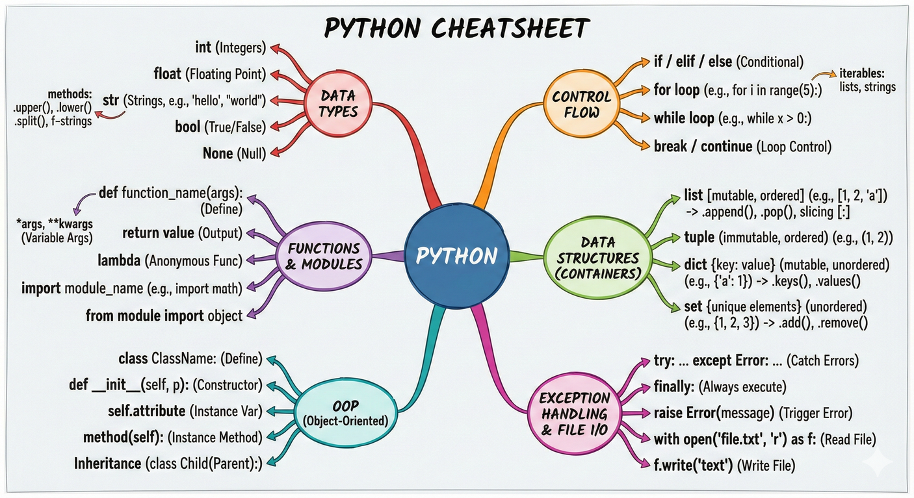

---
title: Python Cheat Sheet
description: A comprehensive reference guide for Python, covering syntax, data structures, functions, modules, and more.
---

# Python Cheat Sheet

[TOC]

This cheat sheet provides an exhaustive overview of the Python programming language, covering essential syntax, data structures, functions, modules, and best practices for efficient development. It aims to be a one-stop reference for common tasks.

??? note "**Python Mindmap** - Visual Overview"

    

## Getting Started

### Installation

Check if Python is already installed:

```bash
python --version
python3 --version
```

Install Python using a package manager (e.g., `apt`, `brew`, `choco`) or from the official website:

*   [Python Downloads](https://www.python.org/downloads/)

### Running Python Code

Interactive Mode:

```bash
python
python3
```

Run a Python Script:

```bash
python my_script.py
python3 my_script.py
```

## Basic Syntax

### Comments

```python
# This is a single-line comment

"""
This is a multi-line comment
"""
```

### Variables

```python
x = 10
name = "Alice"
is_active = True
```

### Data Types

**`int`** - Integer numbers
```python
x = 42  # Immutable, supports +, -, *, /, //, %, **
```

**`float`** - Floating-point numbers
```python
pi = 3.14  # Immutable, supports arithmetic ops, .is_integer()
```

**`str`** - Strings (text)
```python
name = "Alice"  # Immutable, supports +, *, slicing, .upper(), .lower(), .split()
```

**`bool`** - Boolean values
```python
is_active = True  # Subclass of int (True=1, False=0)
```

**`list`** - Ordered, mutable collection
```python
items = [1, 2, 3]  # Mutable, supports indexing, .append(), .extend(), .pop()
```

**`tuple`** - Ordered, immutable collection
```python
coords = (10, 20)  # Immutable, faster than lists, supports indexing
```

**`dict`** - Key-value pairs
```python
user = {"name": "Bob", "age": 30}  # Mutable, supports .keys(), .values(), .items()
```

**`set`** - Unordered, unique elements
```python
tags = {1, 2, 3}  # Mutable, supports .add(), .remove(), set operations (|, &, -)
```

**`NoneType`** - Absence of value
```python
result = None  # Singleton object, often used as default/placeholder
```

### Operators

**Arithmetic Operators**
```python
x, y = 10, 3
x + y    # 13 - Addition
x - y    # 7  - Subtraction
x * y    # 30 - Multiplication
x / y    # 3.33 - Division (float)
x // y   # 3  - Floor division (integer)
x % y    # 1  - Modulus (remainder)
x ** y   # 1000 - Exponentiation (power)
```

**Comparison Operators**
```python
x, y = 5, 3
x == y   # False - Equal to
x != y   # True  - Not equal to
x > y    # True  - Greater than
x < y    # False - Less than
x >= y   # True  - Greater than or equal to
x <= y   # False - Less than or equal to
```

**Logical Operators**
```python
x, y = True, False
x and y  # False - Logical AND (both must be True)
x or y   # True  - Logical OR (at least one must be True)
not x    # False - Logical NOT (negates the value)
```

**Assignment Operators**
```python
x = 10      # Simple assignment
x += 5      # x = x + 5  (compound addition)
x -= 3      # x = x - 3  (compound subtraction)
x *= 2      # x = x * 2  (compound multiplication)
x /= 4      # x = x / 4  (compound division)
x //= 2     # x = x // 2 (compound floor division)
x %= 3      # x = x % 3  (compound modulus)
x **= 2     # x = x ** 2 (compound exponentiation)
```

**Identity Operators**
```python
a = [1, 2, 3]
b = a
c = [1, 2, 3]
a is b       # True  - Same object in memory
a is c       # False - Different objects (same values)
a is not c   # True  - Different objects
```

**Membership Operators**
```python
my_list = [1, 2, 3, 4, 5]
3 in my_list        # True  - Value exists in sequence
6 in my_list        # False - Value doesn't exist
6 not in my_list    # True  - Value doesn't exist
```

**Bitwise Operators** (work on binary representations)
```python
a, b = 5, 3  # Binary: 101, 011
a & b    # 1   - AND (001)
a | b    # 7   - OR (111)
a ^ b    # 6   - XOR (110)
~a       # -6  - NOT (inverts all bits)
a << 1   # 10  - Left shift (1010)
a >> 1   # 2   - Right shift (010)
```

### Control Flow

If Statement:

```python
x = 10
if x > 0:
    print("Positive")
elif x == 0:
    print("Zero")
else:
    print("Negative")
```

For Loop:

```python
for i in range(5):
    print(i)
```

While Loop:

```python
i = 0
while i < 5:
    print(i)
    i += 1
```

Break and Continue:

```python
for i in range(10):
    if i == 3:
        break  # Exit the loop
    if i == 1:
        continue  # Skip to the next iteration
    print(i)
```

Try-Except Block:

```python
try:
    result = 10 / 0
except ZeroDivisionError:
    print("Cannot divide by zero")
finally:
    print("This will always execute")
```

### Functions

Defining a Function:

```python
def greet(name="World"):
    """This function greets the person passed in as a parameter.
    If no parameter is passed, it greets the world."""
    print(f"Hello, {name}!")

greet("Alice")
greet()
```

Function Arguments:

**Positional Arguments** - Required, order matters
```python
def greet(name, age):
    print(f"{name} is {age} years old")
greet("Alice", 30)  # Must provide in order
```

**Keyword Arguments** - Named parameters, order flexible
```python
greet(age=30, name="Alice")  # Order doesn't matter
```

**Default Arguments** - Optional with default values
```python
def greet(name, greeting="Hello"):
    print(f"{greeting}, {name}!")
greet("Alice")           # Uses default greeting
greet("Bob", "Hi")       # Overrides default
```

**`*args`** - Variable positional arguments (tuple)
```python
def sum_all(*numbers):
    return sum(numbers)
sum_all(1, 2, 3, 4, 5)   # Can pass any number of args
```

**`**kwargs`** - Variable keyword arguments (dict)
```python
def print_info(**info):
    for key, value in info.items():
        print(f"{key}: {value}")
print_info(name="Alice", age=30, city="NYC")
```

**Combined Example** - All argument types together
```python
def my_function(a, b=2, *args, **kwargs):
    print(f"a: {a}, b: {b}, args: {args}, kwargs: {kwargs}")

my_function(1, 2, 3, 4, name="Alice", age=30)
# Output: a: 1, b: 2, args: (3, 4), kwargs: {'name': 'Alice', 'age': 30}
```

Lambda Functions:

```python
square = lambda x: x ** 2
print(square(5))
```

### Data Structures

Lists:

```python
my_list = [1, 2, "hello", True]
my_list.append(5)
my_list.insert(2, "new")
my_list.remove(2)
my_list.pop(1)
print(my_list[0])
print(my_list[-1])
print(my_list[1:3])
```

Tuples:

```python
my_tuple = (1, 2, "hello")
print(my_tuple[0])
```

Dictionaries:

```python
my_dict = {"name": "Alice", "age": 30}
my_dict["city"] = "New York"
print(my_dict["name"])
print(my_dict.get("age"))
print(my_dict.keys())
print(my_dict.values())
print(my_dict.items())
```

Sets:

```python
my_set = {1, 2, 3, 4}
my_set.add(5)
my_set.remove(2)
print(my_set)
```

### List Comprehensions

```python
numbers = [1, 2, 3, 4, 5]
squares = [x ** 2 for x in numbers]
even_squares = [x ** 2 for x in numbers if x % 2 == 0]
```

### Dictionary Comprehensions

```python
numbers = [1, 2, 3, 4, 5]
square_dict = {x: x ** 2 for x in numbers}
```

### Set Comprehensions

```python
numbers = [1, 2, 2, 3, 4, 4, 5]
unique_squares = {x ** 2 for x in numbers}
```

### Generators

```python
def my_generator(n):
    for i in range(n):
        yield i ** 2

for value in my_generator(5):
    print(value)
```

## Modules and Packages

### Importing Modules

```python
import math
print(math.sqrt(16))

import datetime
now = datetime.datetime.now()
print(now)

from collections import Counter
```

### Creating Modules

Create a file named `my_module.py`:

```python
def my_function():
    print("Hello from my_module!")

my_variable = 10
```

Import and use the module:

```python
import my_module

my_module.my_function()
print(my_module.my_variable)
```

### Packages

Create a directory named `my_package` with an `__init__.py` file inside.

Create modules inside the package (e.g., `my_package/module1.py`, `my_package/module2.py`).

Import and use the package:

```python
import my_package.module1
from my_package import module2

my_package.module1.my_function()
module2.another_function()
```

## File I/O

### Reading from a File

```python
with open("my_file.txt", "r") as f:
    content = f.read()
    print(content)
```

### Writing to a File

```python
with open("my_file.txt", "w") as f:
    f.write("Hello, file!")
```

### Appending to a File

```python
with open("my_file.txt", "a") as f:
    f.write("\nAppending to the file.")
```

### Reading Lines from a File

```python
with open("my_file.txt", "r") as f:
    for line in f:
        print(line.strip())
```

## String Formatting

### f-strings (Python 3.6+)

```python
name = "Alice"
age = 30
print(f"My name is {name} and I am {age} years old.")
```

### str.format()

```python
name = "Alice"
age = 30
print("My name is {} and I am {} years old.".format(name, age))
```

### % Formatting

```python
name = "Alice"
age = 30
print("My name is %s and I am %d years old." % (name, age))
```

## Decorators

```python
def my_decorator(func):
    def wrapper(*args, **kwargs):
        print("Before function execution")
        result = func(*args, **kwargs)
        print("After function execution")
        return result
    return wrapper

@my_decorator
def say_hello(name):
    print(f"Hello, {name}!")

say_hello("Alice")
```

### Decorators with Arguments

```python
def repeat(num_times):
    def decorator_repeat(func):
        def wrapper(*args, **kwargs):
            for _ in range(num_times):
                result = func(*args, **kwargs)
            return result
        return wrapper
    return decorator_repeat

@repeat(num_times=3)
def greet(name):
    print(f"Hello {name}")

greet("Alice")
```

## Context Managers

```python
with open("my_file.txt", "r") as f:
    content = f.read()
    print(content)

# Custom context manager
class MyContextManager:
    def __enter__(self):
        print("Entering the context")
        return self

    def __exit__(self, exc_type, exc_val, exc_tb):
        print("Exiting the context")
        if exc_type:
            print(f"An exception occurred: {exc_type}")

    def do_something(self):
        print("Doing something in the context")

with MyContextManager() as cm:
    cm.do_something()
```

## Object-Oriented Programming (OOP)

### Classes and Objects

```python
class Dog:
    def __init__(self, name, breed):
        self.name = name
        self.breed = breed

    def bark(self):
        print("Woof!")

my_dog = Dog("Buddy", "Golden Retriever")
print(my_dog.name)
my_dog.bark()
```

### Inheritance

```python
class Animal:
    def __init__(self, name):
        self.name = name

    def speak(self):
        raise NotImplementedError("Subclass must implement abstract method")

class Dog(Animal):
    def speak(self):
        return "Woof!"

class Cat(Animal):
    def speak(self):
        return "Meow!"

dog = Dog("Buddy")
cat = Cat("Whiskers")
print(dog.speak())
print(cat.speak())
```

### Encapsulation

```python
class MyClass:
    def __init__(self):
        self._protected_variable = 10  # Protected variable (convention)
        self.__private_variable = 20  # Private variable (name mangling)

    def get_private(self): #getter
        return self.__private_variable

    def set_private(self, value): #setter
        if value > 0:
            self.__private_variable = value

obj = MyClass()
print(obj._protected_variable)
# print(obj.__private_variable)  # AttributeError: 'MyClass' object has no attribute '__private_variable'
print(obj.get_private()) # Accessing private variable through a getter method.
obj.set_private(30)
print(obj.get_private())
```

### Polymorphism

```python
class Animal:
    def speak(self):
        raise NotImplementedError("Subclass must implement abstract method")

class Dog(Animal):
    def speak(self):
        return "Woof!"

class Cat(Animal):
    def speak(self):
        return "Meow!"

def animal_sound(animal):
    print(animal.speak())

dog = Dog("Buddy")
cat = Cat("Whiskers")
animal_sound(dog)
animal_sound(cat)
```

### Class Methods and Static Methods

```python
class MyClass:
    class_variable = 0

    def __init__(self, instance_variable):
        self.instance_variable = instance_variable

    @classmethod
    def increment_class_variable(cls):
        cls.class_variable += 1

    @staticmethod
    def static_method():
        print("This is a static method")

MyClass.increment_class_variable()
print(MyClass.class_variable)
MyClass.static_method()
```

## Metaclasses

```python
class MyMetaclass(type):
    def __new__(cls, name, bases, attrs):
        attrs['attribute'] = 100
        return super().__new__(cls, name, bases, attrs)

class MyClass(metaclass=MyMetaclass):
    pass

obj = MyClass()
print(obj.attribute)  # Output: 100
```

## Abstract Base Classes (ABCs)

```python
from abc import ABC, abstractmethod

class MyAbstractClass(ABC):
    @abstractmethod
    def my_method(self):
        pass

class MyConcreteClass(MyAbstractClass):
    def my_method(self):
        print("Implementation of my_method")

# obj = MyAbstractClass()  # TypeError: Can't instantiate abstract class MyAbstractClass with abstract methods my_method
obj = MyConcreteClass()
obj.my_method()
```

## Exception Handling

```python
try:
    result = 10 / 0
except ZeroDivisionError:
    print("Cannot divide by zero")
except Exception as e:
    print(f"An error occurred: {e}")
else:
    print("No errors occurred")
finally:
    print("This will always execute")
```

### Raising Exceptions

```python
def divide(x, y):
    if y == 0:
        raise ValueError("Cannot divide by zero")
    return x / y
```

### Custom Exceptions

```python
class MyCustomError(Exception):
    pass

def my_function():
    raise MyCustomError("Something went wrong")
```

## Iterators and Generators

### Iterators

```python
my_list = [1, 2, 3]
my_iterator = iter(my_list)
print(next(my_iterator))
print(next(my_iterator))
print(next(my_iterator))
```

### Generators

```python
def my_generator(n):
    for i in range(n):
        yield i ** 2

for value in my_generator(5):
    print(value)

# Generator expression
squares = (x**2 for x in range(5))
for square in squares:
    print(square)
```

## Descriptors

```python
class MyDescriptor:
    def __get__(self, instance, owner):
        print(f"Getting: instance={instance}, owner={owner}")
        return instance._value

    def __set__(self, instance, value):
        print(f"Setting: instance={instance}, value={value}")
        instance._value = value

    def __delete__(self, instance):
        print(f"Deleting: instance={instance}")
        del instance._value

class MyClass:
    my_attribute = MyDescriptor()

obj = MyClass()
obj.my_attribute = 10
print(obj.my_attribute)
del obj.my_attribute
```

## Working with Dates and Times

```python
import datetime

now = datetime.datetime.now()
print(now)

today = datetime.date.today()
print(today)

# Creating datetime objects
dt = datetime.datetime(2024, 1, 1, 12, 30, 0)

# Formatting datetime objects
formatted_date = now.strftime("%Y-%m-%d %H:%M:%S")
print(formatted_date)

# Parsing strings into datetime objects
parsed_date = datetime.datetime.strptime("2024-01-01 12:30:00", "%Y-%m-%d %H:%M:%S")
print(parsed_date)

# Time deltas
delta = datetime.timedelta(days=5, hours=3)
new_date = now + delta
print(new_date)

# Working with timezones
import pytz
timezone = pytz.timezone("America/Los_Angeles")
localized_time = timezone.localize(datetime.datetime(2024, 1, 1, 12, 0, 0))
print(localized_time)
```

## Working with CSV Files

```python
import csv

# Reading CSV files
with open('my_data.csv', 'r') as file:
    reader = csv.reader(file)
    for row in reader:
        print(row)

# Writing CSV files
data = [['Name', 'Age', 'City'],
        ['Alice', 30, 'New York'],
        ['Bob', 25, 'Paris']]

with open('output.csv', 'w', newline='') as file:
    writer = csv.writer(file)
    writer.writerows(data)

# Reading CSV files as dictionaries
with open('my_data.csv', mode='r') as csv_file:
    csv_reader = csv.DictReader(csv_file)
    for row in csv_reader:
        print(row['Name'], row['Age'], row['City'])

# Writing CSV files from dictionaries
fieldnames = ['Name', 'Age', 'City']
data = [
    {'Name': 'Alice', 'Age': 30, 'City': 'New York'},
    {'Name': 'Bob', 'Age': 25, 'City': 'Paris'}
]

with open('output.csv', mode='w', newline='') as csv_file:
    writer = csv.DictWriter(csv_file, fieldnames=fieldnames)

    writer.writeheader()
    writer.writerows(data)
```

## Working with JSON

```python
import json

# Serializing Python objects to JSON
data = {"name": "Alice", "age": 30, "city": "New York"}
json_string = json.dumps(data, indent=4) # indent for pretty printing
print(json_string)

# Deserializing JSON to Python objects
parsed_data = json.loads(json_string)
print(parsed_data["name"])

# Reading JSON from a file
with open("data.json", "r") as f:
    data = json.load(f)

# Writing JSON to a file
with open("data.json", "w") as f:
    json.dump(data, f, indent=4)
```

## Working with Regular Expressions

```python
import re

text = "The quick brown fox jumps over the lazy dog."
pattern = r"\b\w{5}\b"  # Matches 5-letter words

# Search for a pattern
match = re.search(pattern, text)
if match:
    print(match.group(0))

# Find all occurrences of a pattern
matches = re.findall(pattern, text)
print(matches)  # Output: ['quick', 'brown', 'jumps']

# Replace occurrences of a pattern
new_text = re.sub(pattern, "five", text)
print(new_text)

# Split a string by a pattern
parts = re.split(r"\s+", text) # Split by whitespace
print(parts)

# Compile a pattern for reuse
compiled_pattern = re.compile(pattern)
matches = compiled_pattern.findall(text)
```

## Working with OS

```python
import os

# Get the current working directory
current_directory = os.getcwd()
print(current_directory)

# Change the current working directory
os.chdir("/path/to/new/directory")

# List files and directories
files_and_dirs = os.listdir(".")
print(files_and_dirs)

# Create a directory
os.mkdir("my_new_directory")
os.makedirs("path/to/new/directory") # Creates intermediate directories as needed

# Remove a file
os.remove("my_file.txt")

# Remove a directory
os.rmdir("my_empty_directory")
import shutil
shutil.rmtree("my_directory") # Removes a directory and its contents

# Join path components
new_path = os.path.join(current_directory, "my_folder")
print(new_path)

# Check if a path exists
if os.path.exists(new_path):
    print("Path exists")

# Check if a path is a file
if os.path.isfile("my_file.txt"):
    print("It's a file")

# Check if a path is a directory
if os.path.isdir("my_folder"):
    print("It's a directory")

# Get the file extension
filename, extension = os.path.splitext("my_file.txt")
print(extension)

# Get environment variables
print(os.environ.get("HOME"))
```

## Working with Collections

```python
import collections

# Counter
my_list = [1, 2, 2, 3, 3, 3, 4, 4, 4, 4]
count = collections.Counter(my_list)
print(count)
print(count.most_common(2))

# defaultdict
my_dict = collections.defaultdict(int)
my_dict["a"] += 1
print(my_dict["a"])
print(my_dict["b"])  # Accessing a missing key returns the default value

# namedtuple
Point = collections.namedtuple("Point", ["x", "y"])
p = Point(10, 20)
print(p.x, p.y)

# deque
my_deque = collections.deque([1, 2, 3])
my_deque.append(4)
my_deque.appendleft(0)
my_deque.pop()
my_deque.popleft()
print(my_deque)

# OrderedDict (less relevant in Python 3.7+ where dicts maintain insertion order)
my_ordered_dict = collections.OrderedDict()
my_ordered_dict['a'] = 1
my_ordered_dict['b'] = 2
my_ordered_dict['c'] = 3
print(my_ordered_dict)

# ChainMap
dict1 = {'a': 1, 'b': 2}
dict2 = {'c': 3, 'd': 4}
chain = collections.ChainMap(dict1, dict2)
print(chain['a'])
print(chain['c'])
```

## Working with Itertools

```python
import itertools

# Count
for i in itertools.count(start=10, step=2):
    if i > 20:
        break
    print(i)

# Cycle
count = 0
for item in itertools.cycle(['A', 'B', 'C']):
    if count > 5:
        break
    print(item)
    count += 1

# Repeat
for item in itertools.repeat("Hello", 3):
    print(item)

# Chain
list1 = [1, 2, 3]
list2 = [4, 5, 6]
for item in itertools.chain(list1, list2):
    print(item)

# Combinations
for combo in itertools.combinations([1, 2, 3, 4], 2):
    print(combo)

# Permutations
for perm in itertools.permutations([1, 2, 3], 2):
    print(perm)

# Product
for prod in itertools.product([1, 2], ['a', 'b']):
    print(prod)

# Groupby
data = [('A', 1), ('A', 2), ('B', 3), ('B', 4), ('C', 5)]
for key, group in itertools.groupby(data, key=lambda x: x[0]):
    print(key, list(group))

# islice
data = [1, 2, 3, 4, 5, 6, 7, 8, 9, 10]
for item in itertools.islice(data, 2, 7, 2):  # start, stop, step
    print(item)

# starmap
data = [(1, 2), (3, 4), (5, 6)]
for result in itertools.starmap(lambda x, y: x * y, data):
    print(result)

# takewhile
data = [1, 2, 3, 4, 5, 6, 7, 8, 9, 10]
for item in itertools.takewhile(lambda x: x < 5, data):
    print(item)

# dropwhile
for item in itertools.dropwhile(lambda x: x < 5, data):
    print(item)
```

## Working with Functools

```python
import functools

# partial
def power(base, exponent):
    return base ** exponent

square = functools.partial(power, exponent=2)
cube = functools.partial(power, exponent=3)

print(square(5))  # Output: 25
print(cube(2))    # Output: 8

# lru_cache
@functools.lru_cache(maxsize=None)
def fibonacci(n):
    if n < 2:
        return n
    return fibonacci(n-1) + fibonacci(n-2)

print(fibonacci(10))

# reduce
numbers = [1, 2, 3, 4, 5]
product = functools.reduce(lambda x, y: x * y, numbers)
print(product)

# wraps
def my_decorator(func):
    @functools.wraps(func)
    def wrapper(*args, **kwargs):
        """Wrapper function docstring"""
        print("Before function execution")
        result = func(*args, **kwargs)
        print("After function execution")
        return result
    return wrapper

@my_decorator
def say_hello(name):
    """This function greets the person passed in as a parameter."""
    print(f"Hello, {name}!")

print(say_hello.__name__) # Output: say_hello
print(say_hello.__doc__) # Output: This function greets the person passed in as a parameter.
```

## Concurrency and Parallelism

### Threads

```python
import threading

def my_task(name):
    print(f"Thread {name}: starting")
    # Perform some work
    print(f"Thread {name}: finishing")

threads = []
for i in range(3):
    t = threading.Thread(target=my_task, args=(i,))
    threads.append(t)
    t.start()

for t in threads:
    t.join()
```

### Processes

```python
import multiprocessing

def my_task(name):
    print(f"Process {name}: starting")
    # Perform some work
    print(f"Process {name}: finishing")

processes = []
for i in range(3):
    p = multiprocessing.Process(target=my_task, args=(i,))
    processes.append(p)
    p.start()

for p in processes:
    p.join()
```

### Asyncio

```python
import asyncio

async def my_coroutine(name):
    print(f"Coroutine {name}: starting")
    await asyncio.sleep(1)
    print(f"Coroutine {name}: finishing")

async def main():
    tasks = [my_coroutine(i) for i in range(3)]
    await asyncio.gather(*tasks)

asyncio.run(main())
```

### ThreadPoolExecutor

```python
from concurrent.futures import ThreadPoolExecutor

def task(n):
    print(f"Processing {n}")
    return n * 2

with ThreadPoolExecutor(max_workers=3) as executor:
    results = executor.map(task, range(5))
    for result in results:
        print(result)
```

### ProcessPoolExecutor

```python
from concurrent.futures import ProcessPoolExecutor

def task(n):
    print(f"Processing {n}")
    return n * 2

with ProcessPoolExecutor(max_workers=3) as executor:
    results = executor.map(task, range(5))
    for result in results:
        print(result)
```

## Type Hints

```python
def add(x: int, y: int) -> int:
    return x + y

def greet(name: str) -> str:
    return f"Hello, {name}!"

from typing import List, Tuple, Dict, Optional, Union, Any

my_list: List[int] = [1, 2, 3]
my_tuple: Tuple[str, int] = ("Alice", 30)
my_dict: Dict[str, int] = {"a": 1, "b": 2}

def process_item(item: Union[str, int]) -> Optional[str]:
    if isinstance(item, str):
        return item.upper()
    elif isinstance(item, int):
        return str(item * 2)
    else:
        return None

def my_function(x: Any) -> None:
    pass
```

## Virtual Environments

### Using venv (Built-in)

**Creating a Virtual Environment**

```bash
python -m venv myenv
```

**Activating a Virtual Environment**

On Linux/macOS:

```bash
source myenv/bin/activate
```

On Windows:

```bash
myenv\Scripts\activate
```

**Deactivating a Virtual Environment**

```bash
deactivate
```

### Using Conda

**Creating a Conda Environment**

```bash
# Create environment with specific Python version
conda create --name myenv python=3.11

# Create environment with packages
conda create --name myenv python=3.11 numpy pandas scikit-learn

# Create from environment.yml file
conda env create -f environment.yml
```

**Activating a Conda Environment**

```bash
conda activate myenv
```

**Deactivating a Conda Environment**

```bash
conda deactivate
```

**Managing Conda Environments**

```bash
# List all environments
conda env list

# Remove an environment
conda env remove --name myenv

# Export environment to file
conda env export > environment.yml

# Clone an environment
conda create --name newenv --clone myenv
```

**Installing Packages in Conda**

```bash
# Install packages
conda install numpy pandas matplotlib

# Install specific version
conda install numpy=1.24.0

# Install from conda-forge channel
conda install -c conda-forge package_name

# List installed packages
conda list

# Update a package
conda update numpy

# Update all packages
conda update --all
```

## Testing

### Using `unittest`

```python
import unittest

class MyTestCase(unittest.TestCase):
    def test_addition(self):
        self.assertEqual(1 + 1, 2)

    def test_subtraction(self):
        self.assertNotEqual(5 - 2, 4)

    def test_raises_exception(self):
        with self.assertRaises(ValueError):
            raise ValueError

if __name__ == '__main__':
    unittest.main()
```

### Using `pytest`

Installation:

```bash
pip install pytest
```

Test Example:

```python
# test_my_module.py
def add(x, y):
    return x + y

def test_add():
    assert add(1, 2) == 3
    assert add(-1, 1) == 0
```

Run tests:

```bash
pytest
```

## Logging

```python
import logging

# Basic configuration
logging.basicConfig(level=logging.DEBUG, format='%(asctime)s - %(name)s - %(levelname)s - %(message)s')

# Create a logger
logger = logging.getLogger(__name__)

# Log messages
logger.debug("This is a debug message")
logger.info("This is an info message")
logger.warning("This is a warning message")
logger.error("This is an error message")
logger.critical("This is a critical message")

# Logging to a file
file_handler = logging.FileHandler('my_log.log')
file_handler.setLevel(logging.WARNING)
formatter = logging.Formatter('%(asctime)s - %(name)s - %(levelname)s - %(message)s')
file_handler.setFormatter(formatter)
logger.addHandler(file_handler)
```

## Debugging

### Using `pdb` (Python Debugger)

```python
import pdb

def my_function(x, y):
    z = x + y
    pdb.set_trace()  # Set a breakpoint
    return z

my_function(1, 2)
```

### Using `print()` Statements

```python
def my_function(x, y):
    print(f"x: {x}, y: {y}")
    z = x + y
    print(f"z: {z}")
    return z
```

## Best Practices

*   Use virtual environments to isolate project dependencies.
*   Use meaningful names for variables and functions.
*   Follow the DRY (Don't Repeat Yourself) principle.
*   Write unit tests to ensure code quality.
*   Use a consistent coding style (PEP 8).
*   Document your code.
*   Use a version control system (e.g., Git).
*   Use appropriate data types for your data.
*   Handle exceptions gracefully.
*   Use logging to track events and errors.
*   Use a security linter (e.g., Bandit) to identify potential vulnerabilities.
*   Follow security best practices.
*   Use a linter (like `flake8`) and formatter (like `black`) to ensure consistent code style.
*   Use a code coverage tool (like `coverage.py`) to measure test coverage.
*   Use a static analysis tool (like `mypy`) to check for type errors.
*   Use a profiler to identify performance bottlenecks.
*   Use a debugger to step through your code and inspect variables.
*   Use a build tool (like `setuptools`) to package and distribute your code.
*   Use a continuous integration (CI) system to automatically run tests and build your code.
*   Use a continuous deployment (CD) system to automatically deploy your code to production.
*   Use a monitoring tool to track the performance of your application in production.
*   Use a configuration management tool (like Ansible, Chef, or Puppet) to manage your infrastructure.
*   Use a containerization tool like Docker.
*   Use an orchestration tool like Kubernetes.